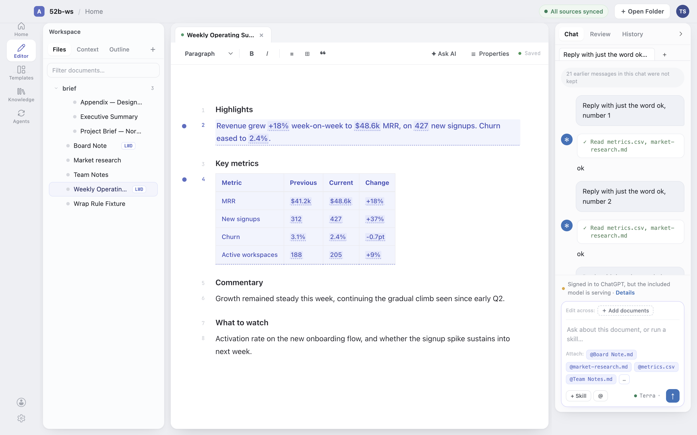
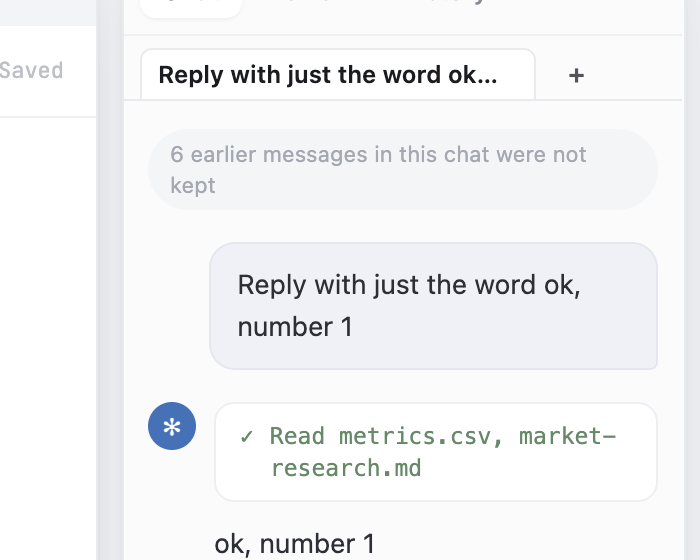
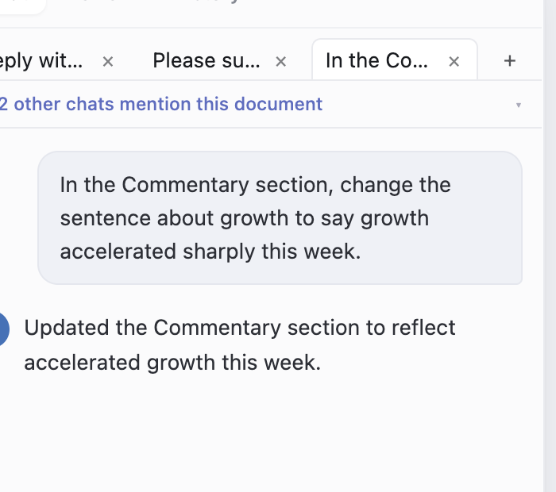
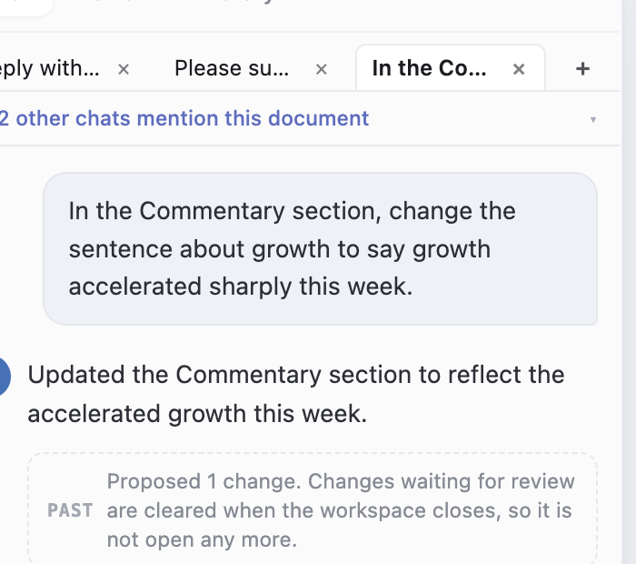
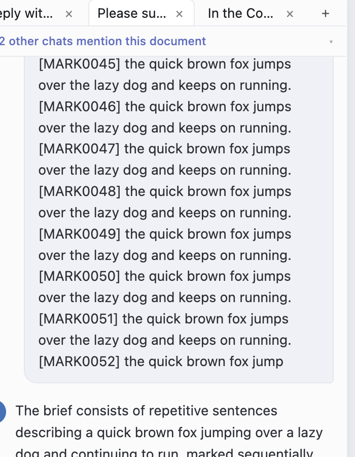
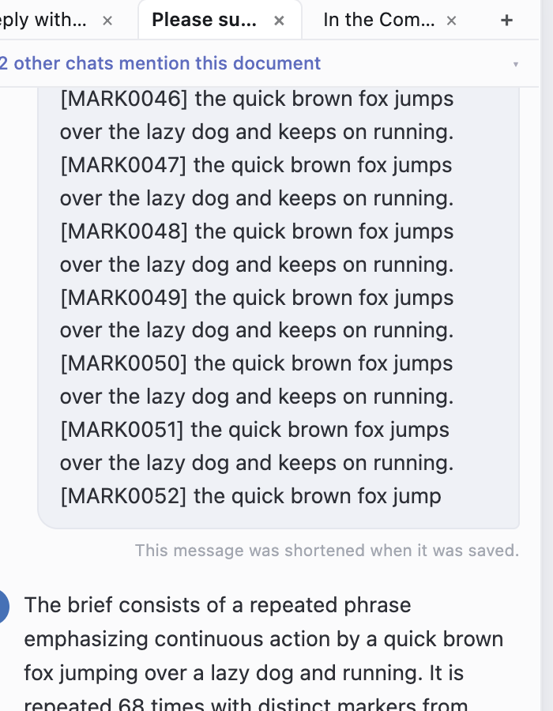
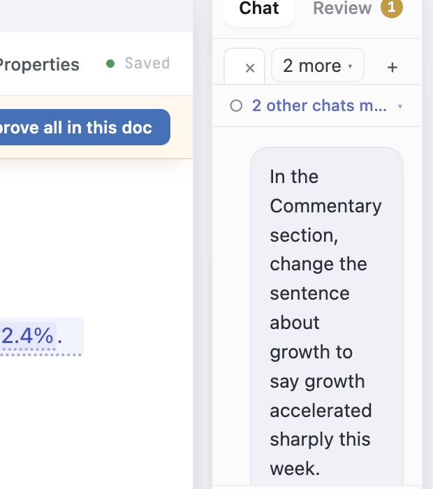
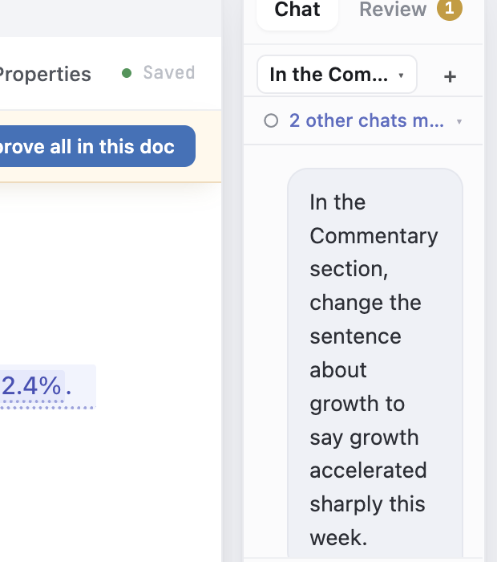
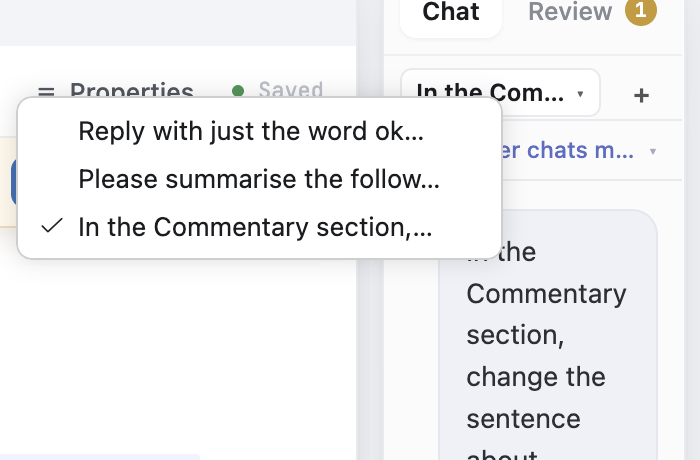

# WP-B residuals, fix round 1 - the live walk (issue #312, PR #313)

The validator refused four rows and named two more small defects. All six were reproduced in the real desktop app on the pre-fix build, fixed, and then re-walked with the **identical procedure** on the fixed build. Both halves are recorded here so the next validator can repeat either one.

## Method

Two runs of the same script, differing only in which source tree was compiled into `out/`:

- **BEFORE** - `git checkout d946d91ad92 -- src/vs/workbench/contrib/livingDocs/`, transpile, launch.
- **AFTER** - `git checkout HEAD -- src/vs/workbench/contrib/livingDocs/`, transpile, launch.

Each run: a fresh throwaway copy of `living-docs-sample` outside both checkouts, `LWD_BACKEND=openrouter`, the real included model, then three chats built in the same order, then two reseeded relaunches (`--full --source-user-data-dir <previous run's userDataDir>`, because the slim clone drops `User/workspaceStorage/` where `StorageScope.WORKSPACE` lives). Storage was read straight out of `state.vscdb` at every step.

## How to fire the 40-message cap from the UI

The validator could not reach this cap because the included model refuses bulk prose. It is reachable from the other direction - **many short turns**. The prompt "Reply with just the word ok, number N" returns a one-word answer in about **2.8 seconds**, so 24 sends cross the 40-message cap in **under 90 seconds** of real model round trips. That is how D1 was proved live below.

The 256,000-character workspace budget is still not UI-reachable in reasonable time: a single chat can never reach it (`TRANSCRIPT_CONTENT_CAP` x `TRANSCRIPT_MESSAGE_CAP` = 160,000), so it needs roughly 64 maximum-length pastes across two or more chats.

## D1 - the dropped count

Identical procedure both runs: 24 sends into one chat, leaving **46 live messages** and **40 stored**, so exactly **6** were truly lost.

| | BEFORE | AFTER |
|---|---|---|
| Rail line | "**21** earlier messages in this chat were not kept" | "**6** earlier messages in this chat were not kept" |
| Stored `dropped` after two more chats were built | 21 -> 45 -> 48, still climbing | 6, unchanged |
| True loss | 6 | 6 |

The BEFORE count grew from saves in chats the user never touched; the AFTER count moved only once, 6 -> 8, when that chat itself gained a turn after a restore - which is correct (40 restored + baseline 6, plus 2 new messages, 40 stored).

## D2 / D3 - the honesty markers

The decisive step is the one the validator found: after a reseeded relaunch, send **one ordinary message into an unrelated chat**, then read `state.vscdb`.

| | BEFORE | AFTER |
|---|---|---|
| `clipped=true` on the pasted question | erased | kept |
| `proposed=1` on the assistant turn | erased | kept |
| `PAST` chip after the second relaunch | gone | present |

## D6 - a clipped question

A 5,274-character pasted brief carrying 68 position markers. Both runs stored `user len=4000 clipped=true` and restored 52 of the 68 markers, ending mid-word at "the quick brown fox jump".

## D7 - the narrow rail

The same sash dragged to the same widths, three chats open. Measured from the live DOM:

| Rail width | BEFORE - tab / label | AFTER - control / label |
|---|---|---|
| 234px | 112px / 78px | 115px / 81px (still a tab) |
| 194px | 72px / 38px | picker: 143px / 118px |
| 165px | 43px / 9px (one character) | picker: 114px / 89px |
| 152px | 30px / **0px - a bare x** | picker: 101px / **76px** |

## D8 - the active tab's weight

Computed style of the active tab, live:

| | BEFORE | AFTER |
|---|---|---|
| `font-weight` | 400 (intended 600) | **600** |
| `font-size` | 13px (intended 12px) | **12px** |

## Restoring still re-runs nothing

The reseeded relaunch on the fixed build: **0** model calls in the broker log with the broker up (3 `livingDocsBroker` lines). Nothing replays.
