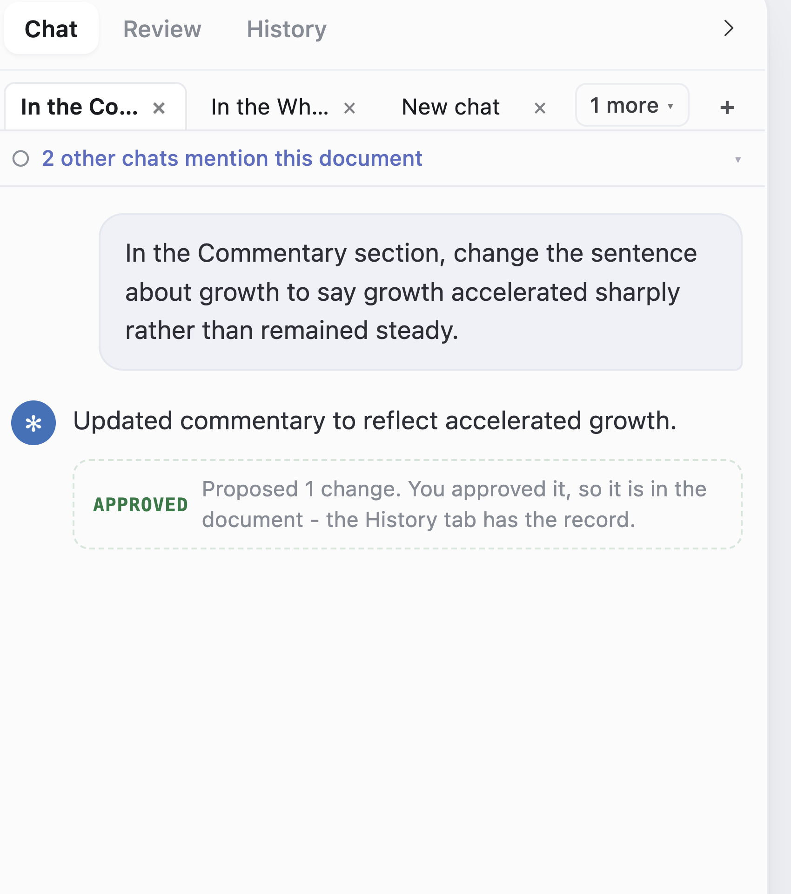
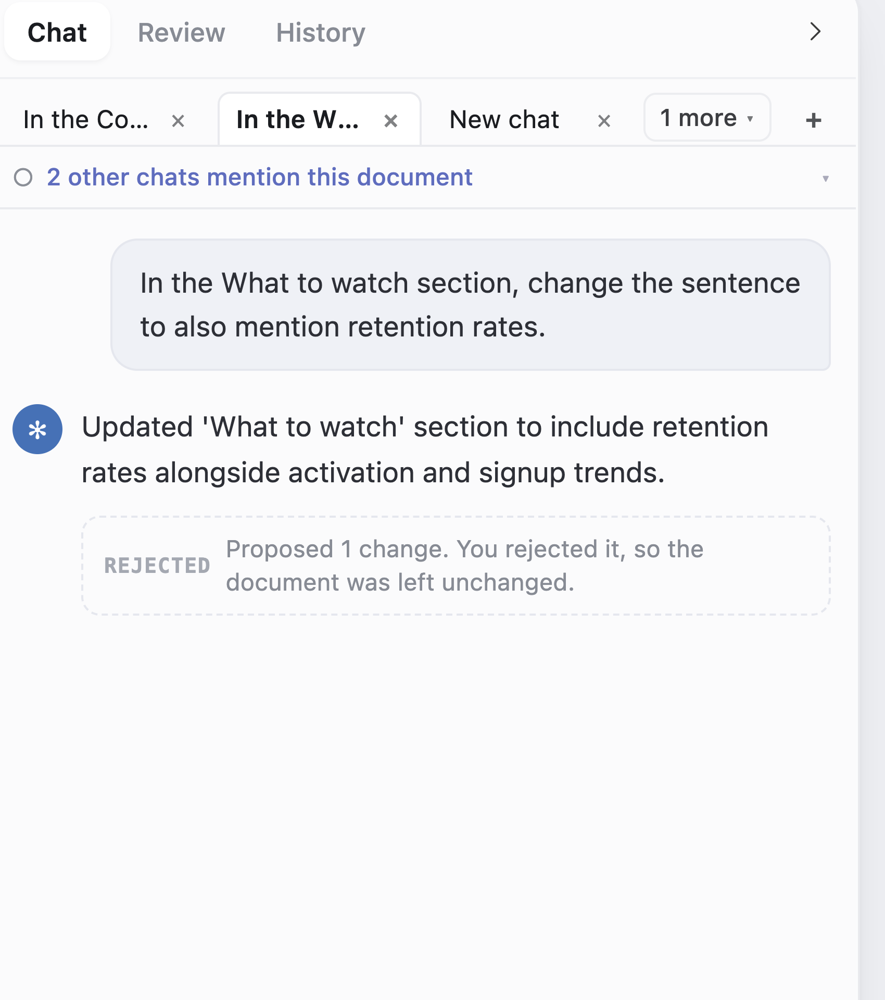
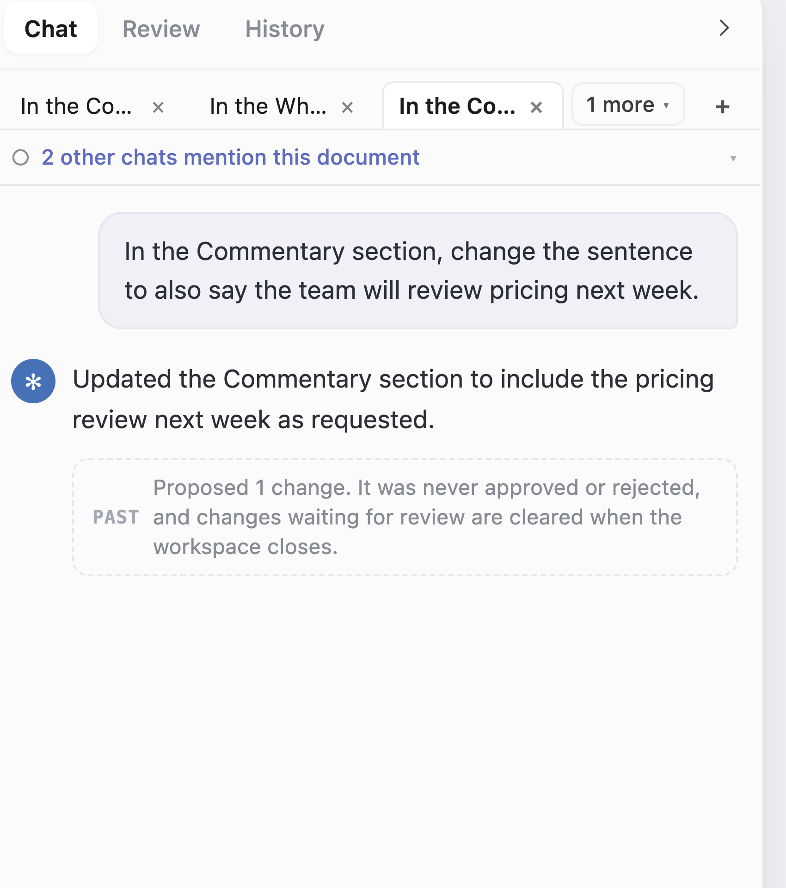
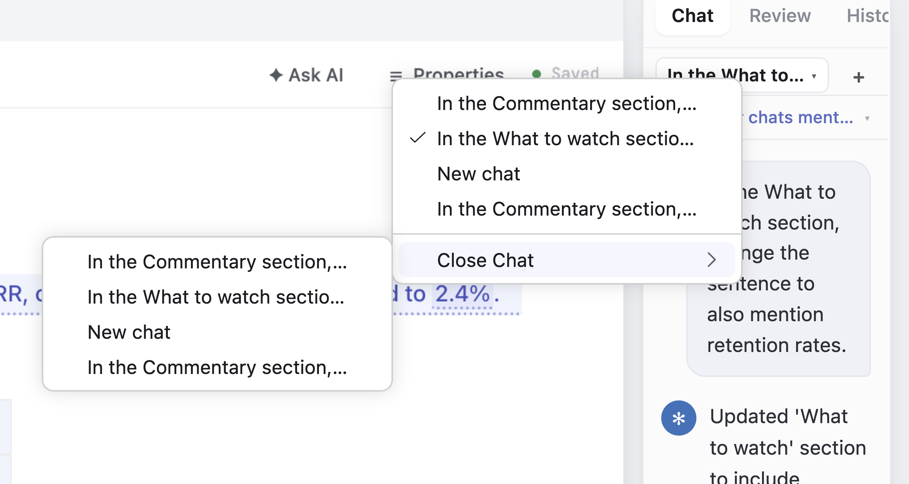
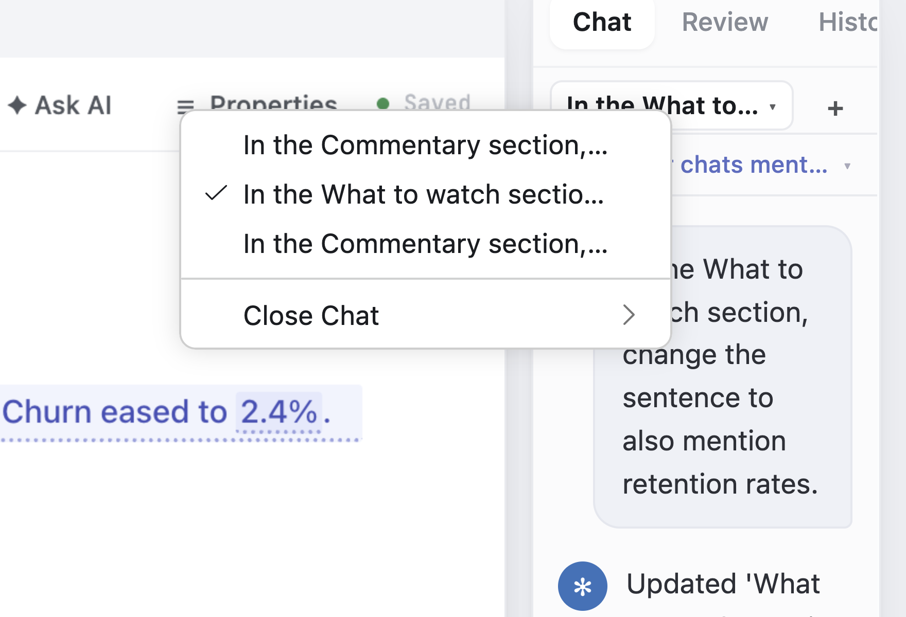
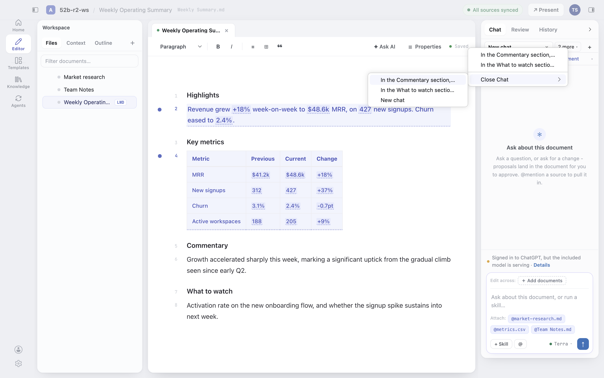

# Fix round 2 - the live walk (issue #312, PR #313)

Four items from validator round 2: V1 (an approved proposal told it was discarded), V2 (a chat that cannot be closed), V3 (the overflow chip's width) and V4 (the trim notice's tense). This is what was driven in the real desktop app, in order, with what came back.

**Setup.** A throwaway workspace at `/tmp/52b-r2-ws` (a copy of `living-docs-sample`, never the repo's own), the real included model (`LWD_BACKEND=openrouter`), and reseeded relaunches (`--full --source-user-data-dir <previous run's userDataDir>`), because the slim profile clone drops `User/workspaceStorage/` - which is exactly where `StorageScope.WORKSPACE` lives.

## V1 - three proposals, three fates, three sentences

Three chats were built on `Weekly Operating Summary`, each proposing exactly one change, and each change was given a different ending:

| Chat | What was asked | What was done to the change |
|---|---|---|
| 1 | change the Commentary sentence to say growth accelerated sharply | **Approved from the document**, on the inline widget |
| 2 | change the What to watch sentence to mention retention rates | **Rejected** |
| 3 | change the Commentary sentence to mention a pricing review | **Left pending**, and the workspace was closed on it |

Chat 1's approval really landed - the file on disk read `Growth accelerated sharply this week, marking a significant uptick from the gradual climb seen since early Q2.` Chat 2's rejection left `Activation rate on the new onboarding flow, and whether the signup spike sustains into next week.` untouched.

`livingDocs.chatTranscripts` read straight out of `state.vscdb` before the relaunch, and again after it:

```
3d259941  assistant  proposed=1  approved=None  rejected=None     <- left pending
f9e7dba8  assistant  proposed=1  approved=None  rejected=1        <- rejected
20d5c605  assistant  proposed=1  approved=1     rejected=None     <- approved
```

Three different records, written as the user acted. After the reseeded relaunch, walking the three tabs:

| Chat | Marker | Sentence |
|---|---|---|
| approved | `APPROVED` (green) | "Proposed 1 change. You approved it, so it is in the document - the History tab has the record." |
| rejected | `REJECTED` | "Proposed 1 change. You rejected it, so the document was left unchanged." |
| left pending | `PAST` | "Proposed 1 change. It was never approved or rejected, and changes waiting for review are cleared when the workspace closes." |

The third sentence is the one the app used to say about all three. The History tab, three inches away, read `Approved · Weekly Operating Summary / b-5` and `Rejected · b-7` - the two records the old wording contradicted.







## V2 - closing a chat at a width with no close box

The rail was dragged by its real sash to **170px**, where the strip is a picker: one control naming the chat you are in, a "+", and no `×` anywhere on screen. The picker's menu now carries a **Close Chat** submenu listing every chat.



Closing "New chat" from that submenu removed it - reopening the menu showed three chats where there had been four. This is a chat closed at a width where nothing could previously be closed at all, and a chat the user was **not** standing on.



The same row is in the strip's overflow menu, which is the other half of the same hole: at the ~282px default with three chats, only one tab is visible, so the other two had no reachable `×`.



There is also a **Close Chat** entry in the command palette, beside the existing New Chat.

## V3 - the overflow chip, measured

At the 282px default with three chats the chip drew **63.0px** ("2 more ▾"), against the new one-digit budget of 64. The budget now grows with the digits in the count, so the 69.2px "14 more ▾" the validator measured is paid for as well.

## V4 - the trim notice

Reworded to the present tense ("N earlier messages in this chat are not being kept"), with a hover explaining that the messages on screen are held in memory and will not be there after a restart. **Not seen live** in this walk - it needs more than 40 messages in one chat, and the walk above did not build one.
